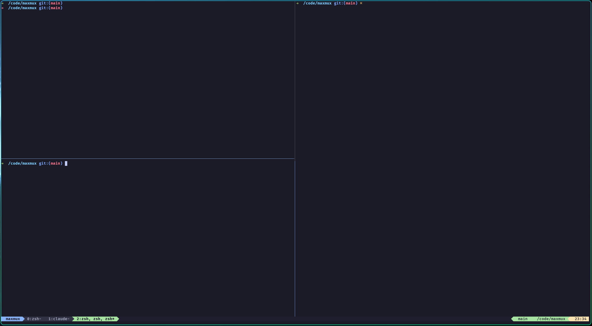

<p align="center">
  
</p>

<h1 align="center">MaxMux</h1>

<p align="center">
  A modern terminal session manager — like tmux, but built with TypeScript.
</p>

<p align="center">
  <a href="https://www.npmjs.com/package/@maxischmaxi/maxmux"></a>
  <a href="https://github.com/maxischmaxi/maxmux/releases/latest"></a>
  <a href="https://github.com/maxischmaxi/maxmux/blob/main/LICENSE"></a>
</p>

**Why MaxMux?**

- **TypeScript config** — `maxmux.config.ts` instead of `.tmux.conf`
- **Plugin system** — extend with hooks, not shell scripts
- **Auto-save** — sessions persist and restore automatically
- **Persistent windows** — switch between windows without losing terminal content
- **Flexible keybindings** — prefix-based, global, or both — bind any key to any command
- **Copy mode** — vi-style text selection and clipboard copy
- **Modern stack** — built on Bun, node-pty, and xterm-headless

---

## Table of Contents

- [Installation](#installation)
- [Quick Start](#quick-start)
- [Keybindings](#keybindings)
- [Copy Mode](#copy-mode)
- [CLI Commands](#cli-commands)
- [Configuration](#configuration)
- [Custom Keybindings](#custom-keybindings)
- [Plugins](#plugins)
- [Architecture](#architecture)
- [Shell Autostart](#shell-autostart)
- [Requirements](#requirements)
- [License](#license)

---

## Installation

### One-liner (recommended)

```bash
curl -fsSL https://raw.githubusercontent.com/maxischmaxi/maxmux/main/install.sh | sh
```

This detects your OS and architecture automatically, downloads the right binary, and installs it to `/usr/local/bin`.

To install to a custom directory:

```bash
curl -fsSL https://raw.githubusercontent.com/maxischmaxi/maxmux/main/install.sh | MAXMUX_INSTALL_DIR=~/.local/bin sh
```

### Standalone Binary

Download the prebuilt binary for your platform from [GitHub Releases](https://github.com/maxischmaxi/maxmux/releases/latest):

```bash
# Linux (x64)
curl -fsSL https://github.com/maxischmaxi/maxmux/releases/latest/download/maxmux-linux-x64 -o maxmux
chmod +x maxmux
sudo mv maxmux /usr/local/bin/

# Linux (ARM64)
curl -fsSL https://github.com/maxischmaxi/maxmux/releases/latest/download/maxmux-linux-arm64 -o maxmux
chmod +x maxmux
sudo mv maxmux /usr/local/bin/

# macOS (Apple Silicon)
curl -fsSL https://github.com/maxischmaxi/maxmux/releases/latest/download/maxmux-darwin-arm64 -o maxmux
chmod +x maxmux
sudo mv maxmux /usr/local/bin/

# macOS (Intel)
curl -fsSL https://github.com/maxischmaxi/maxmux/releases/latest/download/maxmux-darwin-x64 -o maxmux
chmod +x maxmux
sudo mv maxmux /usr/local/bin/
```

### Via npm (requires Bun runtime)

```bash
npm install -g @maxischmaxi/maxmux
```

### Via Bun

```bash
bun add -g @maxischmaxi/maxmux
```

### From Source

```bash
git clone https://github.com/maxischmaxi/maxmux.git
cd maxmux
bun install

# Run directly
bun run src/index.ts

# Or build a standalone binary
bun run build
sudo mv maxmux /usr/local/bin/
```

---

## Quick Start

```bash
# Start MaxMux (launches server + attaches to a new session)
maxmux

# You're now inside a MaxMux session.
# The default prefix key is Ctrl+a.
# Press Ctrl+a, then a key to run a command:

#   Ctrl+a c    → create a new window
#   Ctrl+a n    → next window
#   Ctrl+a %    → split pane horizontally
#   Ctrl+a "    → split pane vertically
#   Ctrl+a d    → detach (return to your normal shell)

# Reattach to the session
maxmux attach
```

---

## Keybindings

All default keybindings use a **prefix key** (default: `Ctrl+a`).
Press the prefix, release, then press the action key.

### Windows

| Keys           | Action            |
| -------------- | ----------------- |
| `prefix` + `c` | Create new window |
| `prefix` + `n` | Next window       |
| `prefix` + `p` | Previous window   |
| `prefix` + `,` | Rename window     |
| `prefix` + `&` | Close window      |

Windows preserve their terminal content — programs like vim keep running in the background when you switch windows, and the full screen is restored when you switch back.

### Panes

| Keys               | Action                          |
| ------------------ | ------------------------------- |
| `prefix` + `%`     | Split horizontally (left/right) |
| `prefix` + `"`     | Split vertically (top/bottom)   |
| `prefix` + `o`     | Cycle to next pane              |
| `prefix` + `x`     | Close current pane              |
| `prefix` + `z`     | Toggle pane zoom (fullscreen)   |
| `prefix` + `Arrow` | Focus pane in direction         |

### Sessions

| Keys           | Action               |
| -------------- | -------------------- |
| `prefix` + `d` | Detach from session  |
| `prefix` + `s` | Session list         |
| `prefix` + `f` | Fuzzy session finder |
| `prefix` + `N` | Create new session   |
| `prefix` + `$` | Rename session       |

### Copy Mode & Other

| Keys           | Action               |
| -------------- | -------------------- |
| `prefix` + `[` | Enter copy mode      |
| `prefix` + `Q` | Kill server          |
| `prefix` + `:` | Command palette      |
| `prefix` + `?` | Show all keybindings |

---

## Copy Mode

Press `prefix` + `[` to enter copy mode. This freezes the pane content and lets you scroll through the scrollback buffer and copy text.

**Navigation:**

| Key           | Action            |
| ------------- | ----------------- |
| `k` / `Up`    | Move cursor up    |
| `j` / `Down`  | Move cursor down  |
| `h` / `Left`  | Move cursor left  |
| `l` / `Right` | Move cursor right |
| `Ctrl+u`      | Half page up      |
| `Ctrl+d`      | Half page down    |
| `g`           | Go to top         |
| `G`           | Go to bottom      |
| `0`           | Start of line     |
| `$`           | End of line       |
| `w`           | Next word         |
| `b`           | Previous word     |

**Selection & Copy:**

| Key      | Action                             |
| -------- | ---------------------------------- |
| `v`      | Start selection                    |
| `V`      | Start line selection               |
| `y`      | Yank (copy) selection to clipboard |
| `Escape` | Cancel selection / exit copy mode  |
| `q`      | Exit copy mode                     |

You can also select text by dragging with the mouse — the selection is automatically copied to the clipboard on release.

---

## CLI Commands

```bash
maxmux                          # Start server + attach to default session
maxmux new-session [-s name]    # Create a new named session (alias: new)
maxmux attach [-t session]      # Attach to an existing session (alias: a)
maxmux ls                       # List all sessions (alias: list-sessions)
maxmux kill-session -t <name>   # Kill a session
maxmux kill-server              # Stop the MaxMux server
maxmux --help                   # Show help
maxmux --version                # Show version
```

### Remote Control

These commands communicate with a running server via Unix socket, useful for scripting and editor integrations (e.g. Neovim):

```bash
maxmux select-pane -L|-R|-U|-D [-t session]       # Focus pane in direction
maxmux select-window -n|-p [-t session]            # Switch to next/previous window
maxmux split-window -h|-v [-t session]             # Split pane horizontally/vertically
maxmux new-window [-t session]                     # Create a new window
maxmux send-command <command-id> [-t session]       # Execute any command by ID
maxmux display-message -p '<format>' [-t session]  # Query session info
```

### Format Variables

`display-message` supports these format variables:

| Variable            | Description                           |
| ------------------- | ------------------------------------- |
| `#{session_name}`   | Name of the current session           |
| `#{session_id}`     | ID of the current session             |
| `#{window_name}`    | Name of the active window             |
| `#{window_id}`      | ID of the active window               |
| `#{window_index}`   | Index of the active window            |
| `#{pane_id}`        | ID of the active pane                 |
| `#{pane_index}`     | Index of the active pane              |
| `#{pane_at_left}`   | `1` if no pane to the left, else `0`  |
| `#{pane_at_right}`  | `1` if no pane to the right, else `0` |
| `#{pane_at_top}`    | `1` if no pane above, else `0`        |
| `#{pane_at_bottom}` | `1` if no pane below, else `0`        |

---

## Configuration

Create a `maxmux.config.ts` in your project directory or at `~/.config/maxmux/maxmux.config.ts`:

```typescript
import { defineConfig } from "maxmux";

export default defineConfig({
  // Prefix key (default: Ctrl+a)
  prefixKey: "C-a",

  // Timeout for prefix mode in ms (0 = no timeout)
  prefixTimeout: 0,

  // Default shell
  shell: "/bin/zsh",

  // Working directory for new panes (default: "inherit")
  // "inherit" = new panes start in the active pane's directory
  // or set an absolute path to always start there
  newPaneCwd: "inherit",

  // Scrollback buffer lines per pane (default: 10000, max: 100000)
  historyLimit: 10_000,

  // Automatically switch to newly created windows (default: true)
  switchToNewWindow: true,

  // Rename windows to the running process name (default: true)
  automaticRename: true,

  // Mouse support — click to focus panes, drag to select text (default: true)
  mouse: true,

  // Show keybinding help popup after pressing prefix (default: true)
  showPrefixHelp: true,

  // Theme
  theme: {
    statusBar: {
      bg: "#1e1e2e",
      fg: "#cdd6f4",
      active: "#89b4fa",
    },
    border: {
      style: "rounded", // "rounded" | "sharp" | "double" | "none"
      fg: "#585b70",
      activeFg: "#89b4fa",
    },
  },

  // Status bar
  statusBar: {
    enabled: true,
    position: "bottom", // "top" | "bottom"
    theme: "catppuccin-mocha", // "catppuccin-mocha" | "dracula" | "nord" |
    // "tokyo-night" | "gruvbox" | "one-dark" |
    // "solarized" | "custom"
    separator: {
      style: "powerline", // "powerline" | "rounded" | "flat" | "arrow" | "slant"
    },
    icons: true, // Nerd Font icons (requires Nerd Font)
    left: ["session", "windows"],
    right: ["git", "cwd", "datetime"],
    modules: {}, // Per-module overrides (fg, bg, enabled)
    refreshInterval: 1000,
    metricsInterval: 5000,
  },

  // Session list / picker
  sessionList: {
    mode: "sidebar", // "sidebar" | "overlay"
    sidebarPosition: "left", // "left" | "right"
    sidebarWidth: 30, // 20–80 columns
  },

  // Keybindings & global keybindings
  keybindings: {
    /* ... */
  },
  globalKeybindings: {
    /* ... */
  },

  // Session persistence
  sessions: {
    autoSave: true,
    autoSaveInterval: 30_000,
    autoRestore: true,
    savePath: "~/.maxmux/sessions/",
  },

  // Plugins
  plugins: [],
});
```

The config is fully type-safe — your editor provides autocomplete for every option.

### Status Bar Modules

These modules can be placed in `statusBar.left` or `statusBar.right`:

| Module      | Description                      |
| ----------- | -------------------------------- |
| `session`   | Current session name             |
| `windows`   | Window tabs                      |
| `datetime`  | Date and time                    |
| `hostname`  | Machine hostname                 |
| `user`      | Current user                     |
| `cwd`       | Working directory of active pane |
| `git`       | Git branch                       |
| `cpu`       | CPU usage                        |
| `ram`       | Memory usage                     |
| `battery`   | Battery level                    |
| `network`   | Network status                   |
| `prefix`    | Prefix key indicator             |
| `pane-info` | Active pane info                 |

---

## Custom Keybindings

MaxMux has a flexible keybinding system. Every command can be bound to any key, in two ways:

### Prefix Keybindings

These require pressing the prefix key first (like tmux). This is the default mode.

```typescript
keybindings: {
  // tmux-style (default): prefix + Arrow
  Up: 'pane:focus-up',
  Down: 'pane:focus-down',
  Left: 'pane:focus-left',
  Right: 'pane:focus-right',

  // Or vim-style: prefix + hjkl
  h: 'pane:focus-left',
  j: 'pane:focus-down',
  k: 'pane:focus-up',
  l: 'pane:focus-right',
}
```

### Global Keybindings

These fire immediately without the prefix key. Useful for frequently used actions.
Supports Ctrl combinations (`C-a` through `C-z`), arrow keys, and regular characters.

```typescript
globalKeybindings: {
  // Vim-style pane navigation without prefix
  'C-h': 'pane:focus-left',
  'C-j': 'pane:focus-down',
  'C-k': 'pane:focus-up',
  'C-l': 'pane:focus-right',
}
```

> **Note:** Global keybindings override normal terminal input for those keys.
> For example, `C-l` normally clears the screen — binding it globally will
> prevent that. Choose keys carefully.

### Available Commands

| Command                 | Description               |
| ----------------------- | ------------------------- |
| `window:create`         | Create a new window       |
| `window:next`           | Switch to next window     |
| `window:previous`       | Switch to previous window |
| `window:rename`         | Rename current window     |
| `window:close`          | Close current window      |
| `pane:split-horizontal` | Split pane left/right     |
| `pane:split-vertical`   | Split pane top/bottom     |
| `pane:next`             | Cycle to next pane        |
| `pane:close`            | Close current pane        |
| `pane:zoom`             | Toggle pane zoom          |
| `pane:focus-up`         | Focus pane above          |
| `pane:focus-down`       | Focus pane below          |
| `pane:focus-left`       | Focus pane to the left    |
| `pane:focus-right`      | Focus pane to the right   |
| `session:create`        | Create a new session      |
| `session:list`          | Show session list         |
| `session:find`          | Fuzzy session finder      |
| `session:rename`        | Rename current session    |
| `session:detach`        | Detach from session       |
| `server:kill`           | Kill the MaxMux server    |
| `command-palette`       | Open command palette      |
| `keybindings:show`      | Show all keybindings      |
| `copy-mode:enter`       | Enter copy mode           |

### Priority

When a key is pressed, MaxMux checks in this order:

1. **Prefix key** — enters prefix mode
2. **Prefix keybinding** (if in prefix mode) — executes bound command
3. **Global keybinding** — executes bound command
4. **Passthrough** — sends input to the terminal

---

## Plugins

Plugins hook into MaxMux lifecycle events to add features:

```typescript
import { defineConfig } from "maxmux";
import type { MaxMuxPlugin } from "maxmux";

function gitBranch(): MaxMuxPlugin {
  return {
    name: "git-branch",
    setup(ctx) {
      ctx.on("render:statusbar", (items) => {
        return [...items, { text: " main", align: "right" }];
      });
    },
  };
}

export default defineConfig({
  plugins: [gitBranch()],
});
```

### Plugin Events

| Event              | Description                                 |
| ------------------ | ------------------------------------------- |
| `session:created`  | A new session was created                   |
| `session:closed`   | A session was closed                        |
| `window:created`   | A new window was created                    |
| `window:closed`    | A window was closed                         |
| `pane:created`     | A new pane was created                      |
| `pane:closed`      | A pane was closed                           |
| `render:statusbar` | Status bar is being rendered (modify items) |
| `config:loaded`    | Configuration was loaded (modify config)    |

---

## Architecture

MaxMux uses a client/server architecture over Unix domain sockets:

```text
Server (~/.maxmux/server.sock)          Clients
┌────────────────────────┐
│  Session Manager       │◄────────── maxmux (attach)
│  PTY Manager           │◄────────── maxmux (attach)
│  Terminal Buffers      │◄────────── maxmux ls (CLI)
│  Plugin System         │◄────────── maxmux select-pane (remote)
│  Auto-Save             │
└────────────────────────┘
```

- The **server** runs as a background daemon, managing PTY processes, sessions, and state
- Each pane has a **virtual terminal buffer** on both server and client for accurate rendering
- **Clients** connect to render the UI, forward input, and display output
- **Remote commands** (`select-pane`, `send-command`, etc.) communicate via the same socket for scripting and editor integrations
- Sessions and their programs (vim, htop, etc.) survive when clients disconnect — just `maxmux attach` to reattach
- Switching windows replays the terminal buffer, so you see exactly what was on screen

---

## Shell Autostart

MaxMux can automatically start when you open a new terminal — just like the common tmux pattern `[[ -z "$TMUX" ]] && exec tmux`.

### Setup

Download the autostart script and source it from your `.zshrc` or `.bashrc`:

```bash
# Download the script (one-time)
mkdir -p ~/.config/maxmux
curl -fsSL https://raw.githubusercontent.com/maxischmaxi/maxmux/main/extras/shell/maxmux-autostart.sh \
  -o ~/.config/maxmux/maxmux-autostart.sh
```

Then add this to your `~/.zshrc` or `~/.bashrc`:

```bash
[ -f ~/.config/maxmux/maxmux-autostart.sh ] && \
  . ~/.config/maxmux/maxmux-autostart.sh
```

> If you installed from source or via npm, you can also source the script directly:
> `. /path/to/maxmux/extras/shell/maxmux-autostart.sh`

### How it works

When sourced, the script checks a series of guards (already inside maxmux? non-interactive shell? no TTY? another multiplexer running? VS Code terminal?) and only launches maxmux if all checks pass.

By default the shell is **replaced** with `exec maxmux`, so the terminal closes when you detach. Set `MAXMUX_AUTOSTART_EXEC=0` to keep the shell alive after detach instead.

### Configuration

Set these variables **before** sourcing the script:

| Variable | Default | Description |
|---|---|---|
| `MAXMUX_AUTOSTART` | *(active)* | `0` to disable autostart entirely |
| `MAXMUX_AUTOSTART_EXEC` | `1` | `1` = `exec` (shell replaced, terminal closes on detach). `0` = shell survives after detach |
| `MAXMUX_AUTOSTART_SESSION` | *(empty)* | Named session to attach/create. Empty = default behavior |
| `MAXMUX_AUTOSTART_BINARY` | `maxmux` | Path to the maxmux binary |
| `MAXMUX_AUTOSTART_SKIP_SSH` | `0` | `1` = skip autostart in SSH sessions |
| `MAXMUX_AUTOSTART_SKIP_VSCODE` | `1` | `0` = also autostart in VS Code terminal |
| `MAXMUX_AUTOSTART_SKIP_IDE` | `1` | `0` = also autostart in JetBrains IDE terminals |

### Examples

```bash
# Always attach to a session named "main"
MAXMUX_AUTOSTART_SESSION="main"
. ~/.config/maxmux/maxmux-autostart.sh

# Keep the shell alive after detach
MAXMUX_AUTOSTART_EXEC=0
. ~/.config/maxmux/maxmux-autostart.sh

# Skip autostart in SSH and use a custom binary path
MAXMUX_AUTOSTART_SKIP_SSH=1
MAXMUX_AUTOSTART_BINARY="$HOME/.local/bin/maxmux"
. ~/.config/maxmux/maxmux-autostart.sh

# Disable autostart for a single shell invocation
MAXMUX_AUTOSTART=0 zsh
```

---

## Requirements

- **Linux** or **macOS** (Windows not yet supported)
- When installing from npm/source: **Bun** >= 1.3.5

The standalone binary has no external dependencies.

---

## License

MIT
